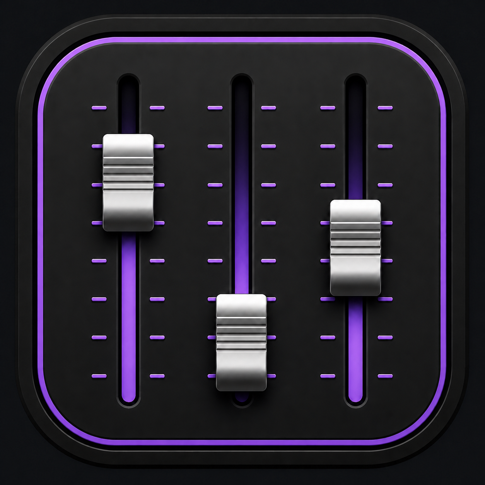

# Windows Fader Bridge for EUCON

<a href="#简体中文">简体中文</a> ・ <a href="#english">English</a> ・ <a href="#日本語">日本語</a>

<strong><a href="https://github.com/lindelea/windows-fader-bridge-eucon/releases/latest">下载 / Download / ダウンロード v1.0.0</a></strong>

## 简体中文

使用 Avid S3、Avid Control 或其他兼容 EUCON 控制台，直接控制 Windows 主音量、输入设备以及每个正在发声的应用。

- 推子、声像、静音、独奏、峰值表和通道选择实时双向同步。
- 支持翻页、媒体信息以及 Windows、UAD、DAW 之间的 EUCON 焦点切换。
- 不需要编译，下载安装程序即可使用。
- 需要 Windows 11 x64 和 Avid EuControl / EUCON Workstation 2026.4。

**[简体中文完整使用手册](docs/USER_GUIDE.zh-CN.md)**

## English

Control Windows master volume, input devices, and individual audio applications directly from an Avid S3, Avid Control, or another compatible EUCON surface.

- Real-time bidirectional fader, pan, mute, solo, meter, and channel-selection feedback.
- Banking, media information, and dedicated EUCON focus switching between Windows, UAD, and a DAW.
- No build tools required; install and start mixing.
- Requires Windows 11 x64 and Avid EuControl / EUCON Workstation 2026.4.

**[Complete English User Guide](docs/USER_GUIDE.en.md)**

## 日本語

Avid S3、Avid Control、または互換 EUCON サーフェスから、Windows のメイン音量、入力デバイス、音声を再生中の各アプリを直接操作します。

- フェーダー、パン、ミュート、ソロ、メーター、チャンネル選択をリアルタイムに双方向同期。
- バンク、メディア情報、Windows・UAD・DAW 間の EUCON フォーカス切り替えに対応。
- ビルド不要。インストーラーですぐに利用できます。
- Windows 11 x64 と Avid EuControl / EUCON Workstation 2026.4 が必要です。

**[日本語の完全なユーザーガイド](docs/USER_GUIDE.ja.md)**

## License and source ・ 许可与源代码 ・ ライセンスとソース

This user-facing repository contains downloads and manuals. The exact v1.0.0 source is in the [development project](https://github.com/lindelea/windows-fader-bridge/tree/v1.0.0). Licensed under [MPL 2.0](LICENSE). This independent project is not affiliated with or endorsed by Avid.
