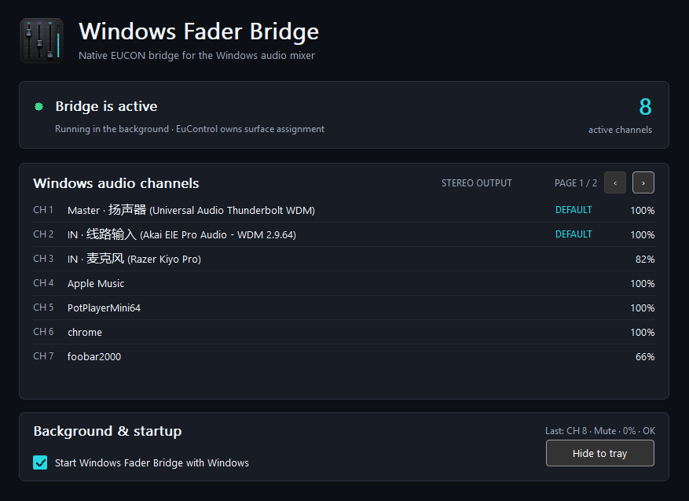
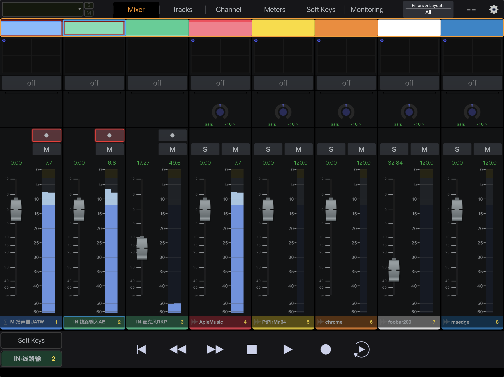
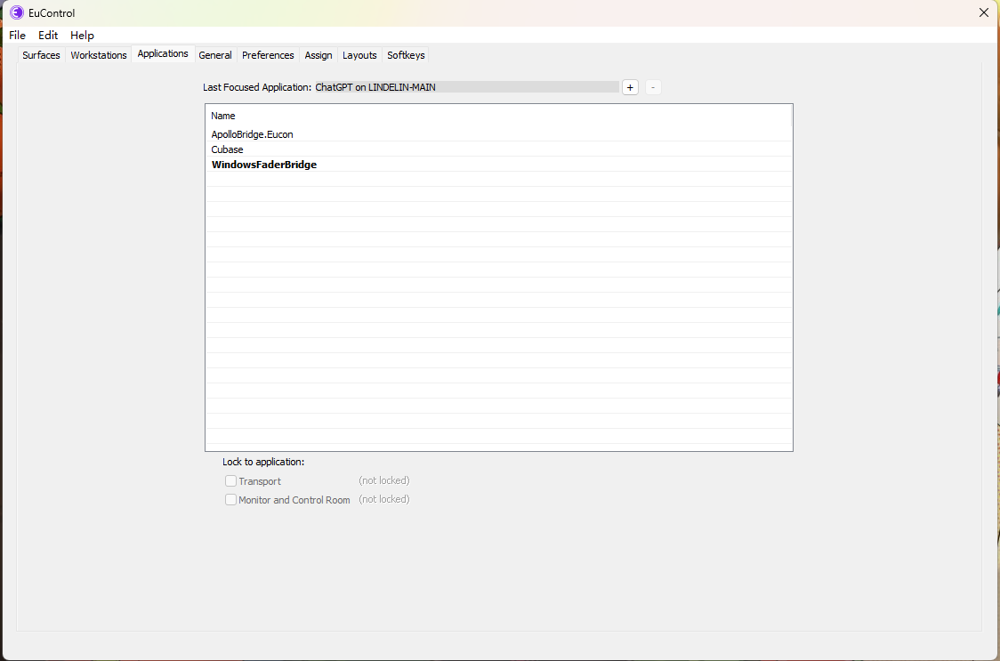
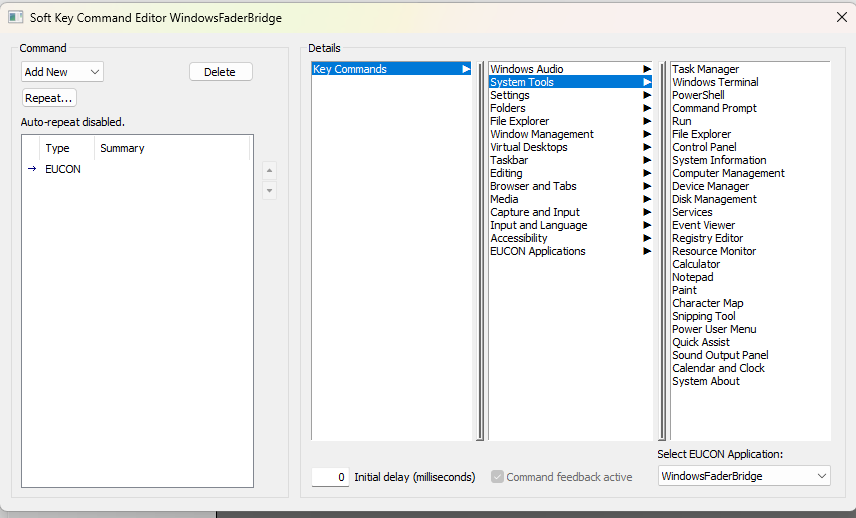

# Windows Fader Bridge for EUCON ユーザーガイド

[简体中文](USER_GUIDE.zh-CN.md) ・ [English](USER_GUIDE.en.md) ・ [ホーム](../README.md)

## このアプリについて

Windows のオーディオミキサーを、独立した EUCON アプリケーションとして公開します。Avid S3、互換サーフェス、または Avid Control から、メイン出力、入力デバイス、音声を再生中の Windows アプリを操作できます。

EuControl やオーディオドライバーを置き換えるものではありません。音量、パン、ミュート、ソロ、選択、メーター、モーターフェーダーのフィードバックをリアルタイムに同期します。

## 実機での使用

S3 と Avid Control には、同じデバイス非依存の EUCON アプリケーションモデルが表示されます。サーフェスの検出、割り当て、バンクは引き続き EuControl が管理します。

## 動作条件

- 64 ビット版 Windows 11。
- Avid EuControl / EUCON Workstation 2026.4 が正常に動作していること。
- EuControl に接続された互換サーフェス、または Avid Control を実行するタブレット。

## インストール

1. [Releases](https://github.com/lindelea/windows-fader-bridge-eucon/releases/latest) から、ファイル名が `Setup-x64.exe` で終わるインストーラーをダウンロードします。
2. 以前に手動で起動したポータブル版を終了し、インストーラーの案内に従います。
3. 必要な Microsoft Visual C++ Runtime も同時に準備されます。
4. スタートメニューから **Windows Fader Bridge for EUCON** を起動します。

現在、このプロジェクトには有料の Windows コード署名証明書がないため、「不明な発行元」と表示される場合があります。本リポジトリの Releases からのみ入手し、必要に応じて公開されている SHA-256 値を確認してください。

## 初回接続

1. EuControl が起動し、サーフェスがオンラインであることを確認します。
2. 本アプリを起動します。概要画面にコントローラー接続済みと表示されれば使用できます。
3. EUCON が別アプリを選択している場合は、このウィンドウを一度前面に出すか、`Ctrl+Alt+Shift+W` を押します。
4. Cubase、Windows オーディオ、UAD Console を頻繁に切り替える場合は、本アプリが提供する **Windows EUCON**、**UAD EUCON** コマンドを EuControl の Soft Key に割り当てます。

起動順序は厳密ではありません。Windows Audio または EUCON の準備が遅れても、自動的に待機して再接続します。

## 基本操作

- フェーダー：チャンネル音量。Master は Windows の既定出力です。
- パンエンコーダー：パンまたはステレオバランス。押すとセンターに戻ります。
- Mute / Solo：Windows の実際の状態を操作・表示します。
- Bank：オンラインチャンネルをグループ単位で移動します。
- メーター：Windows の実レベルを表示します。
- 概要画面の行をクリックすると、そのチャンネルを選択できます。

終了したアプリは一覧から消え、再び音声セッションを作成すると同じ識別情報で戻ります。フェーダーに触れている間は一覧変更を遅らせ、操作対象が別アプリへ飛ばないようにします。

## 設定とバックグラウンド動作

表示言語、Windows サインイン時の起動、トレイ常駐、グローバル呼び出しショートカット、EUCON 認識後すぐバックグラウンドへ戻すかを設定できます。既定は `Ctrl+Alt+Shift+W` です。他のグローバルショートカットと重複しない組み合わせに変更できます。

通常、ウィンドウを閉じても通知領域で動作を続けます。表示、再起動、完全終了はトレイアイコンの右クリックメニューから行います。

## トラブルシューティング

**サーフェスに表示されない：** EuControl と本アプリが起動していること、EuControl の Applications ページに登録されていることを確認し、グローバルショートカットを押します。

**アプリのチャンネルがない：** 対象アプリが Windows オーディオセッションを作成する必要があります。一度再生すると通常は表示されます。

**フェーダーが戻る／同期しない：** 同じ Windows セッションを別ツールが操作していないか確認し、トレイメニューから本アプリを再起動します。続く場合は設定からログフォルダーを開き、最新ログを添付してください。

**アンインストール：** Windows 設定 → アプリ → インストールされているアプリから削除します。再インストール用に個人設定は保持されます。不要なら `%LOCALAPPDATA%` 内の対応フォルダーも手動で削除してください。

## 不具合報告

[GitHub Issues](https://github.com/lindelea/windows-fader-bridge-eucon/issues) に、Windows、EuControl、サーフェスの型番とバージョン、再現手順、実際の結果を記載してください。ログにはローカルのアプリ名やデバイス名が含まれる場合があるため、アップロード前に確認してください。
